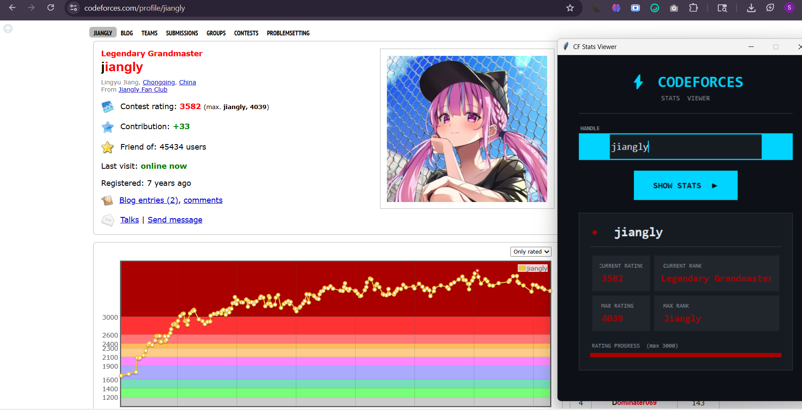

# Codeforces Stats Viewer

A desktop GUI app that fetches and displays a Codeforces user's rating, rank, max rating, and max rank — with an animated dark-themed interface.

## Animated UI Preview



---

## Prerequisites

Before running this app, you need **Python 3.7 or higher** installed on your machine.

### Check if Python is already installed

Open a terminal (Command Prompt / PowerShell on Windows, Terminal on Mac/Linux) and run:

```bash
python --version
```

or on some systems:

```bash
python3 --version
```

If you see something like `Python 3.x.x`, you are good to go. If not, download and install Python from https://www.python.org/downloads/

> **Windows tip:** During installation, check the box **"Add Python to PATH"** before clicking Install.

---

## Step-by-Step Setup

### Step 1 — Clone the repository

```bash
git clone https://github.com/sakshi-engg/Codeforces-Scraper.git
```

> Don't have Git? Download it from https://git-scm.com/downloads, or download the repo as a ZIP from GitHub (green **Code** button > **Download ZIP**) and extract it.

---

### Step 2 — Navigate to the project folder

```bash
cd Codeforces-Scraper
```

---

### Step 3 — Install the required dependency

This app uses the `requests` library to call the Codeforces API. Install it with:

```bash
pip install requests
```

or if your system uses `pip3`:

```bash
pip3 install requests
```

> `tkinter` (the GUI library) comes **pre-installed** with Python on Windows and macOS.
> On Ubuntu/Debian Linux, install it separately:
> ```bash
> sudo apt-get install python3-tk
> ```

---

### Step 4 — Run the application

```bash
python gui.py
```

or:

```bash
python3 gui.py
```

A window will open — type a Codeforces handle and click **SHOW STATS**.

---

## How to Use

1. Type a **Codeforces handle** (username) in the input box — e.g. `tourist`, `Petr`, or your own handle
2. Press **Enter** or click **SHOW STATS**
3. The app fetches live data from the Codeforces API and displays:
   - Current Rating
   - Current Rank
   - Max Rating (all-time best)
   - Max Rank (all-time best)
   - An animated rating progress bar

Ratings are color-coded to match official Codeforces rank colors (gray > green > cyan > blue > purple > orange > red).

---

## Troubleshooting

| Problem | Fix |
|---|---|
| `python` not found | Use `python3` instead, or reinstall Python with PATH enabled |
| `ModuleNotFoundError: requests` | Run `pip install requests` |
| `ModuleNotFoundError: tkinter` | On Linux: `sudo apt-get install python3-tk` |
| App shows "User not found" | Double-check the Codeforces handle spelling |
| Window does not open | Make sure you are running the command from the `Codeforces-Scraper` folder |

---

## Dependencies

| Library | Purpose | Built-in? |
|---|---|---|
| `tkinter` | GUI window and widgets | Yes (with Python) |
| `requests` | HTTP calls to Codeforces API | No — install via pip |
| `threading` | Non-blocking API fetch | Yes (with Python) |

---

## Technologies / Concepts Used

- Python Tkinter — desktop GUI
- REST API — Codeforces public API
- Threading — keeps the UI responsive while fetching data
- Canvas animations — spinning loader and animated rating bar
- Event bindings — hover effects, Enter key support, focus highlights
- OOP — app wrapped in a class for clean state management
